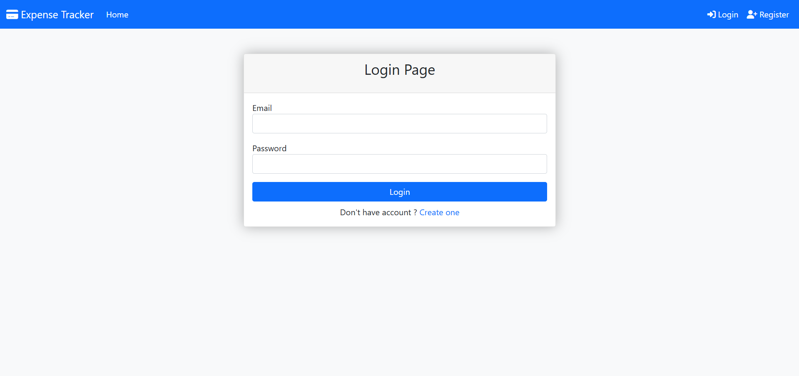
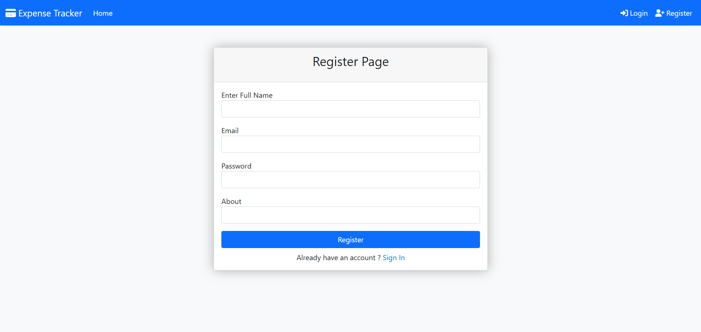

# Online Expense Tracker

A web-based expense management application that helps users track their daily expenses efficiently.

## Features

* User Registration
* User Login & Logout
* Add Expenses
* View Expenses
* Edit Expenses
* Delete Expenses
* Secure Session Management

## Technologies Used

* Java
* JSP
* Servlets
* Hibernate
* MySQL
* Maven
* Apache Tomcat
* Bootstrap

## Project Structure

```text
src/main/java
src/main/webapp
pom.xml
```

## Screenshots

### Home Page


### Login Page



### Register Page



### User Dashboard


### Add Expense


## Database

MySQL database is used for storing:

* User Details
* Expense Records

## Setup Instructions

1. Clone the repository

```bash
git clone https://github.com/PratikPDahale/Online-Expense-Tracker.git
```

2. Configure MySQL database.

3. Update Hibernate configuration.

4. Run the project on Apache Tomcat Server.

5. Open:

```text
http://localhost:8088/Online_Expense_Tracker
```

## Author

Pratik Dahale
